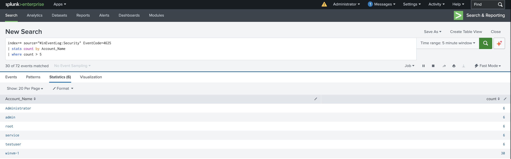
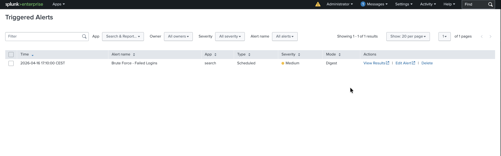

# Lab Exercise 001 — Brute Force Attack Detection
### Format: Incident Report Style
**Date:** 2026-04-15
**Analyst:** Artur B.
**Lab:** SOC Home Lab (VMware Fusion, Apple Silicon M2)

## Summary
Simulated credential stuffing attack against Windows 11 VM using
PowerShell. Attack detected via Windows Security EventCode 4625
(Failed Logon) forwarded to Splunk SIEM. Automated scheduled alert
configured to fire when failed login count per account exceeds 5.

## Attack Details
- **Tool:** PowerShell (Windows native)
- **Method:** Repeated failed authentication attempts using
  PSCredential with incorrect password across multiple accounts
- **Target accounts:** Administrator, admin, root, testuser, service
- **Target:** Windows 11 ARM VM (DESKTOP-H4578B8)

## Attack Simulation Command

    $users = @("Administrator","admin","root","testuser","service")
    foreach ($user in $users) {
        $secpasswd = ConvertTo-SecureString "WrongPass!" -AsPlainText -Force
        $creds = New-Object System.Management.Automation.PSCredential ($user, $secpasswd)
        Start-Job -ScriptBlock { whoami } -Credential $creds 2>$null
    }

## Detection Method
**Log source:** Windows Security Log — EventCode 4625 (Failed Logon)
**SIEM:** Splunk Enterprise (local Mac host)
**Alert:** Scheduled search running every 5 minutes via cron
expression */5 * * * *, triggers when failed login count exceeds 5.

**SPL Query:**

    index=* source="WinEventLog:Security" EventCode=4625
    | stats count by Account_Name
    | where count > 5
    | sort -count

## Evidence

## Findings
Failed login attempts detected across 5 accounts:

- Target accounts (Administrator, admin, root, service, testuser)
  each received 7 failed attempts
- Account winvm-1 accumulated 30 failed attempts from
  earlier testing sessions
- All accounts exceeded the detection threshold of 5

Alert fired successfully and appeared in
Activity → Triggered Alerts in Splunk.

## MITRE ATT&CK Mapping
- **Tactic:** Credential Access
- **Technique:** T1110 — Brute Force
- **Sub-technique:** T1110.004 — Credential Stuffing

## Key Observation
Same password attempted against multiple accounts in rapid
succession — this is credential stuffing, not single-account
brute force. Real attackers use this technique to avoid account
lockout policies that trigger on repeated failures for one account.
Detecting it requires counting total failed logins across all
accounts, not just per-account thresholds.

## Response (Lab Context)
Simulated environment — no containment required.

In production:
- Lock affected accounts immediately
- Block source IP at firewall
- Reset passwords for all targeted accounts
- Check for any successful logins from the same source IP
  before and after the failed attempts
- Escalate to Tier 2 if Administrator account was targeted
