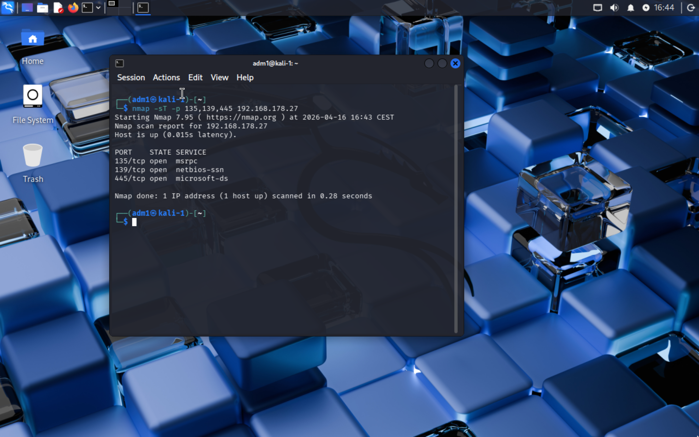
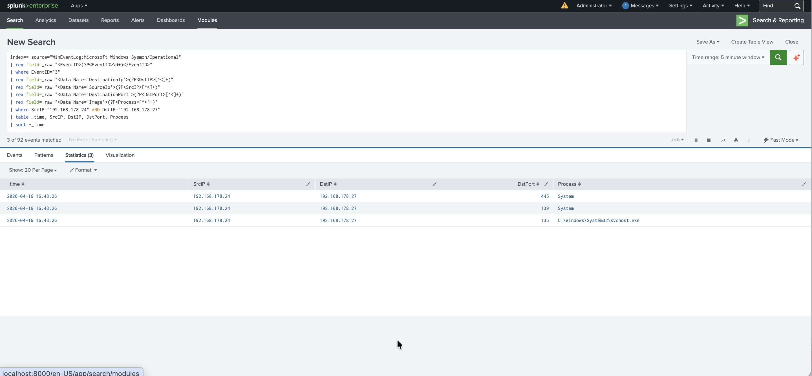

# Lab Exercise 002 — Nmap Port Scan Detection
### Format: Incident Report Style
**Date:** 2026-04-16
**Analyst:** Artur B.
**Lab:** SOC Home Lab (VMware Fusion, Apple Silicon M2)

## Summary
Simulated reconnaissance attack from Kali Linux against Windows 11 VM
using Nmap TCP connect scan (-sT). Attack successfully detected via
Sysmon EventID 3 (Network Connection) forwarded to Splunk SIEM.

## Attack Details
- **Tool:** Nmap 7.95
- **Command:** nmap -sT -p 135,139,445 192.168.178.27
- **Source:** Kali Linux VM (traffic routed via VMware NAT gateway 192.168.178.24)
- **Target:** Windows 11 ARM VM (192.168.178.27)
- **Scan type:** TCP connect scan — completes full TCP handshake

## Detection Method
**Log source:** Sysmon EventID 3 — Network Connection
**SIEM:** Splunk Enterprise (local Mac host)

Sysmon EventID 3 captured inbound connections to Windows VM.
SPL query extracted SourceIP, DestinationIP, DestinationPort,
and Process fields from raw XML events.

**Note:** Kali's actual IP (192.168.161.130) does not appear in
Windows logs because VMware NAT translates it to the host Mac IP
(192.168.178.24). This is a real-world consideration — log entries
do not always show the true source IP when NAT or proxies are involved.

**SPL Query:**

    index=* source="WinEventLog:Microsoft-Windows-Sysmon/Operational"
    | rex field=_raw "<EventID>(?P<EventID>\d+)</EventID>"
    | where EventID="3"
    | rex field=_raw "<Data Name='DestinationIp'>(?P<DstIP>[^<]+)"
    | rex field=_raw "<Data Name='SourceIp'>(?P<SrcIP>[^<]+)"
    | rex field=_raw "<Data Name='DestinationPort'>(?P<DstPort>[^<]+)"
    | rex field=_raw "<Data Name='Image'>(?P<Process>[^<]+)"
    | where SrcIP="192.168.178.24" AND DstIP="192.168.178.27"
    | table _time, SrcIP, DstIP, DstPort, Process
    | sort -_time

## Evidence

## Findings
Four separate scans detected at 14:41, 14:48, 14:53, 14:55.
Each scan generated 3 simultaneous connections within the same second:

- Port **135** (msrpc) → C:\Windows\System32\svchost.exe
- Port **139** (netbios-ssn) → System
- Port **445** (microsoft-ds) → System

## MITRE ATT&CK Mapping
- **Tactic:** Reconnaissance
- **Technique:** T1046 — Network Service Discovery

## Key Observation
Simultaneous connections to ports 135/139/445 within the same second
is a strong indicator of automated port scanning activity. In a real
environment, an attacker scanning these ports is likely preparing for
SMB-based lateral movement or exploitation (e.g. EternalBlue/MS17-010).

## Response (Lab Context)
Simulated environment — no containment required.

In production:
- Isolate affected host from network immediately
- Block source IP at perimeter firewall
- Check for successful connections before the scan (pre-scan activity)
- Investigate whether attacker moved laterally from source host
- Escalate to Tier 2 if SMB ports were successfully accessed
