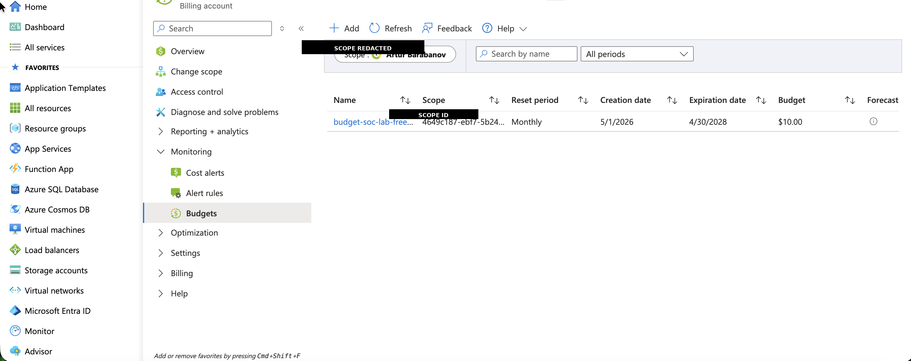
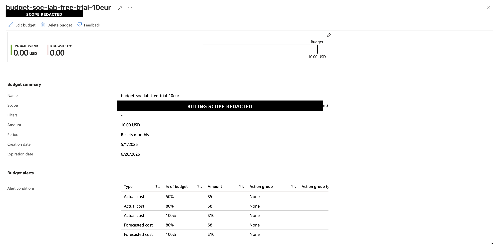
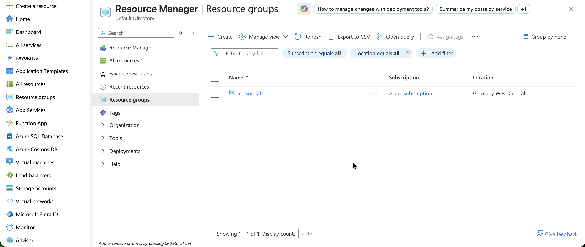
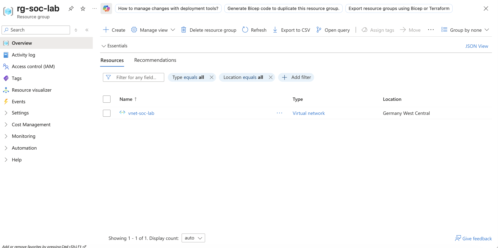
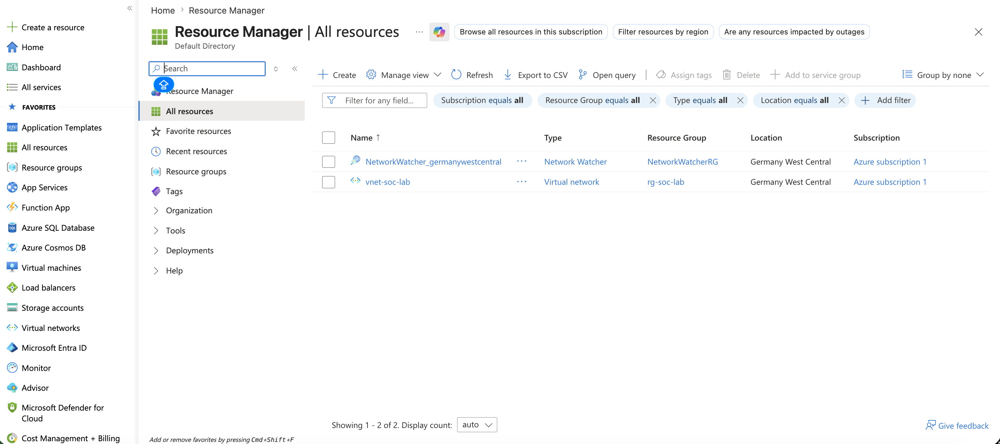
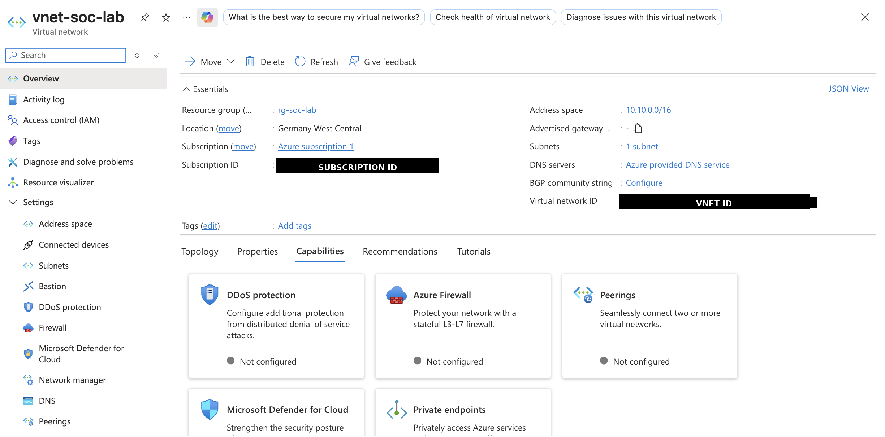
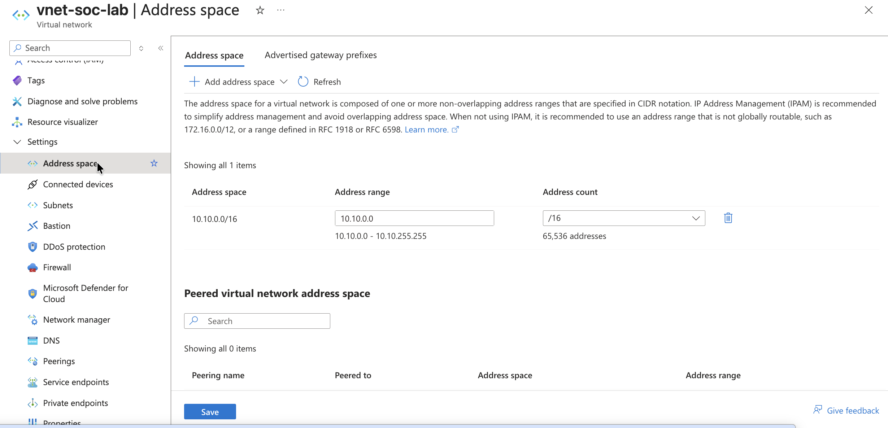
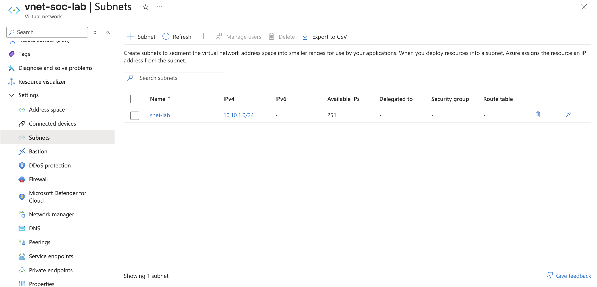
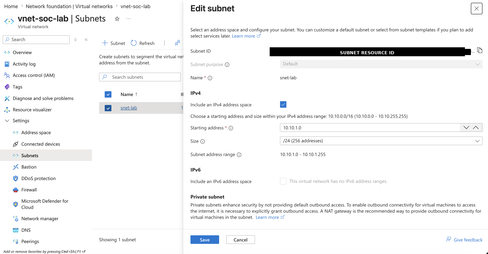

# Lab Exercise 001 — Azure SOC Lab Foundation

### Format: Cloud Security Lab Report Style

**Date:** 2026-06-04  
**Analyst:** Artur B.  
**Lab:** Azure SOC Lab  
**Cloud Provider:** Microsoft Azure  
**Region:** Germany West Central  

---

## Summary

Built the initial Azure foundation for a SOC / Active Directory security lab.

The foundation includes cost control, a dedicated resource group, a virtual network, and a subnet for future Windows Server, Active Directory, logging, and detection engineering exercises.

---

## Objective

Prepare a controlled Azure environment for future SOC lab phases:

- Windows Server VM deployment
- Active Directory Domain Services
- Windows event logging
- Security monitoring
- SIEM integration
- Detection engineering exercises

---

## Environment

| Component | Value |
|---|---|
| Resource Group | `rg-soc-lab` |
| Region | `Germany West Central` |
| Virtual Network | `vnet-soc-lab` |
| VNet Address Space | `10.10.0.0/16` |
| Subnet | `snet-lab` |
| Subnet Address Range | `10.10.1.0/24` |
| Planned Domain Controller | `dc01` |
| Planned DC01 Private IP | `10.10.1.10` |

---

## Implementation Steps

### 1. Cost Control

Created an Azure budget to control lab spending and avoid unexpected costs.

Evidence:

---

### 2. Resource Group

Created a dedicated resource group for the SOC lab.

Evidence:

---

### 3. Virtual Network

Created the virtual network `vnet-soc-lab` inside `rg-soc-lab`.

Evidence:

---

### 4. Address Space

Configured the VNet address space as `10.10.0.0/16`.

Evidence:

---

### 5. Subnet

Created subnet `snet-lab` with address range `10.10.1.0/24`.

Evidence:

---

## Network Design

| Resource | CIDR |
|---|---|
| Virtual Network | `10.10.0.0/16` |
| Lab Subnet | `10.10.1.0/24` |
| Planned DC01 IP | `10.10.1.10` |

---

## Security Notes

- No public workloads were deployed in this phase.
- No credentials, keys, secrets, or connection strings are stored in this repository.
- Subscription IDs, resource IDs, billing account IDs, and personal identifiers are redacted from screenshots where required.
- Future RDP access should be restricted by source IP or handled through Azure Bastion.
- The lab is isolated inside a dedicated resource group.

---

## Findings

The Azure foundation was successfully created and is ready for the next phase.

Completed:

- Azure budget configured
- Resource group created
- Virtual network created
- VNet address space configured
- Subnet created
- Network plan prepared for future domain controller deployment

---

## Next Steps

Next lab:

`Lab Exercise 002 — Deploy Windows Server DC01`

Planned configuration:

| Component | Value |
|---|---|
| VM Name | `dc01` |
| OS | Windows Server |
| Resource Group | `rg-soc-lab` |
| VNet | `vnet-soc-lab` |
| Subnet | `snet-lab` |
| Private IP | `10.10.1.10` |
| Future Domain | `lab.local` |

---

## Artifacts

- `screenshots/01-budget-created.png`
- `screenshots/02-resource-group-created.png`
- `screenshots/03-vnet-visible-in-all-resources.png`
- `screenshots/04-vnet-address-space.png`
- `screenshots/05-subnet-list-snet-lab.png`
- `screenshots/06-resource-group-overview.png`
- `screenshots/07-vnet-overview.png`
- `screenshots/08-subnet-details-snet-lab.png`
- `screenshots/09-budget-alert-details.png`
